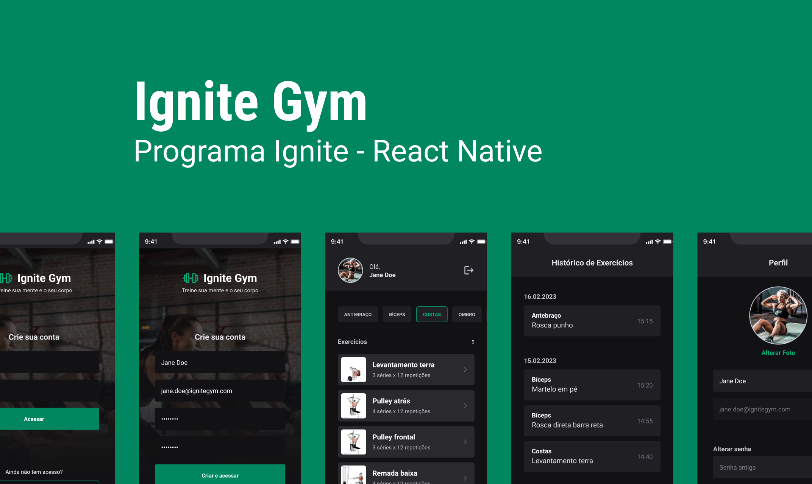
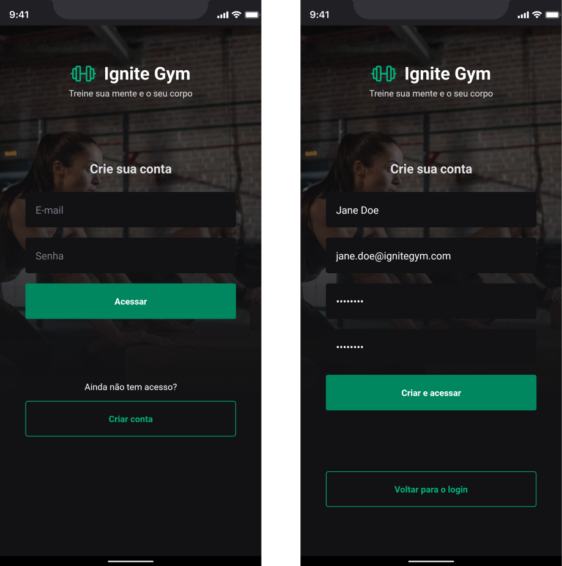
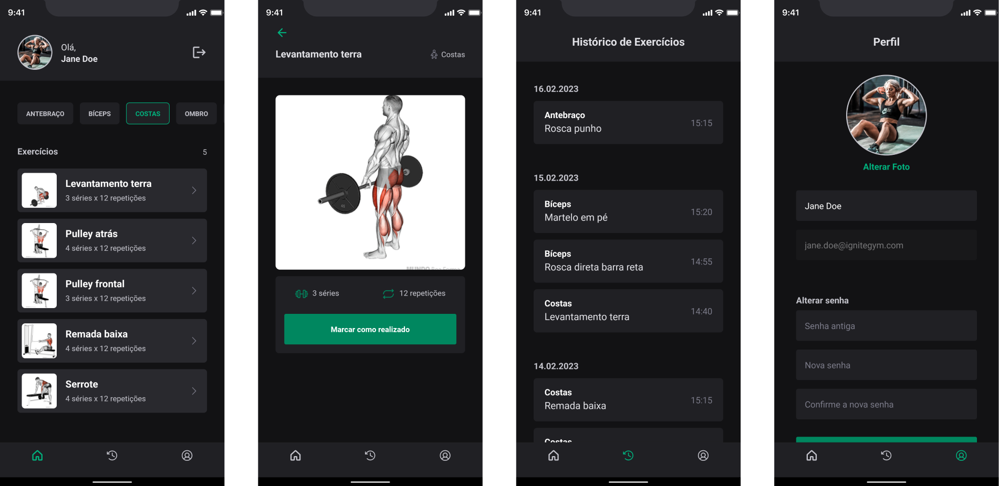
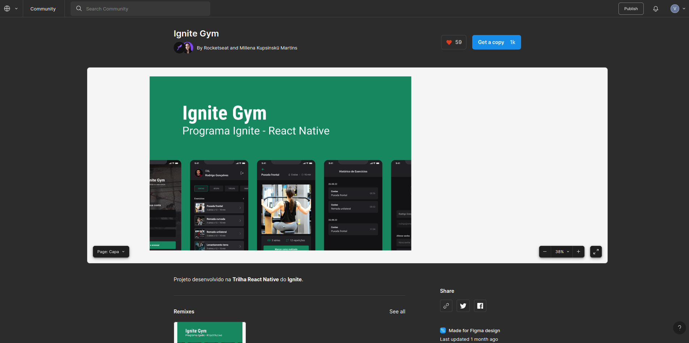

<h1 align="center">
   Ignite Gym
</h1>

<p align="center">


</p>

---

<p align="center">
  <a href="#-projeto">Projeto</a>&nbsp;&nbsp;&nbsp;|&nbsp;&nbsp;&nbsp;
  <a href="#-como-rodar-o-projeto">Como rodar o projeto</a>&nbsp;&nbsp;&nbsp;|&nbsp;&nbsp;&nbsp;
  <a href="#-tecnologias">Tecnologias</a>&nbsp;&nbsp;&nbsp;|&nbsp;&nbsp;&nbsp;
  <a href="#-layout">Layout</a>&nbsp;&nbsp;&nbsp;|&nbsp;&nbsp;&nbsp;
  <a href="#-licença">Licença</a>
</p>

## 💻 Projeto

Bem-vindo ao **Ignite Gym**, o aplicativo perfeito para quem quer atingir seus objetivos de condicionamento físico! Com uma interface de usuário intuitiva, recursos poderosos e conteúdo personalizado, você pode facilmente planejar e monitorar seus exercícios diários, acompanhar seu progresso e atingir suas metas.

Ao se cadastrar e fazer login no aplicativo, você terá acesso a uma grande variedade de exercícios separados por grupos, para que possa escolher os que melhor atendem às suas necessidades e preferências. Você pode criar seus próprios programas de treino personalizados e acompanhar facilmente sua rotina de exercícios, recebendo orientações personalizadas em tempo real para ajudá-lo a manter sua técnica correta e evitar lesões.

Com o **Ignite Gym**, você também pode visualizar o histórico completo de seus treinos por data, para que possa monitorar seu progresso e fazer ajustes para ajudá-lo a atingir seus objetivos de condicionamento físico. Além disso, você pode atualizar suas informações de perfil a qualquer momento para manter suas metas e preferências sempre atualizadas.

Este aplicativo é uma maneira conveniente e fácil de manter-se saudável e em forma. Então comece agora mesmo sua jornada de treinamento com **Ignite Gym** e transforme seus objetivos em realidade!

### 📱 Telas do aplicativo

**Cadastro e Login**



**Tela Inicial, Exercício, Histórico e Perfil**



## 🧭 Como rodar o projeto

### 🚨 Requisitos

**Instalação aplicativo do Expo no smartphone**

- [Expo Android](https://play.google.com/store/apps/details?id=host.exp.exponent&hl=pt_BR&gl=US) ou [Expo iOS](https://apps.apple.com/us/app/expo-go/id982107779)

**Clone este repositório**

```bash
git clone git@github.com:vitorsemidio-dev/rn-ignite-gym.git
```

**Acesse a pasta**

```bash
cd rn-ignite-gym.git
```

### 🔑 Variáveis Ambiente

Deve ajustar o "baseURL" com o ip da máquina e a porta do backend. Exemplo: `http://192.168.11.11:3333`

**Consultar ip no Windows**

Digite no Terminal

```base
ipconfig
```

**Consultar ip no Linux ou MacOS**

Digite no Terminal

```base
ifconfig
```

**Acesse a pasta do Backend, instale as dependências e inicie o projeto**

```bash
cd api
```

```bash
npm install
```

```bash
npm run dev
```

**Instale as dependências e inicie o projeto**

```bash
npm install
```

```bash
npx expo start
```

**Abra o projeto no dispositivo**

Abra o aplicativo do Expo no smartphone, aponte a câmera para o QRCode que apareceu no terminal após executar o comando `npx expo start`.

**Importante**: _O dispositivo móvel e o computador precisam estar na mesma rede_


## 🚀 Tecnologias

Esse projeto foi desenvolvido com as seguintes tecnologias:

- [Axios](https://axios-http.com/ptbr/docs/intro)
- [Expo](https://expo.dev/)
- [Native Base](https://nativebase.io/)
- [React Hook Forms](https://react-hook-form.com/)
- [React Native](https://reactnative.dev/)
- [React Navigation](https://reactnavigation.org/)
- [TypeScript](https://www.typescriptlang.org/pt/)
- [Yup](https://www.npmjs.com/package/yup)

## 🔖 Layout

Você pode visualizar o layout do projeto através [deste link](https://www.figma.com/community/file/1163926136397847279).

<a href="https://www.figma.com/community/file/1163926136397847279">
  
</a>

## 📝 Licença

Esse projeto está sob a licença MIT. Veja o arquivo [LICENSE](LICENSE) para mais detalhes.
